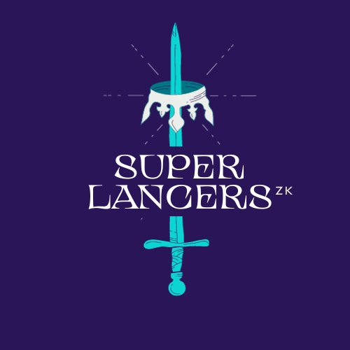

# SuperLancersZK

## Project Description
SuperLancersZK is a pioneering on-chain freelancing platform that offers a solution for tapping into the talent market, featuring decentralized private payments and verifiable credentials.

## Unique Value Proposition

Self sovereign identities and verifiable credentials are the core feature of SuperLancersZK, and we are leveraging Flare network and Scaffold-Eth to make it possible to mint NFT credentials on-chain in a decentralized and transparent manner. Our digital reputation framework uses Aztec Token Bridge to preserve privacy in payments, invoicing and encourage anonymous feedback.

These features work well together to create a reimagined workplace for the on-chain future.

## Problems We're Solving

40% of people lie on their resumes, and three out of four employers have caught a lie on someone's resume. With on-chain actions in SuperLancersZK leaving a digital trail for everyone's skills and activities, SuperLancersZK offer a tamper-proof credentials where organizations can make sure that user profiles are always accurate and truthful.

Discovering talent online and finding the right person to do a task for you is not always easy. SuperLancersZK facilitates talent matching by providing the community an accurate, reliable and searchable representation of real time freelancer qualifications and professional development.

The existing prominent gig marketplaces are centralized, which could lead to concerns surrounding the public disclosure of one's income and personal information. SuperLancersZK addresses and resolves this particular challenge by offering a decentralised gig marketplace.

## Key Features built at ETH London:

- Self-sovereign identities and verifiable credentials, utilizing Flare Network and ERC-1155 Standard for decentralized NFT credential minting. view Code [here](https://github.com/CredLancer/SuperLancers/blob/main/packages/hardhat/hardhat.config.ts), with future cross-chain integration
- Utilized [Gateway.fm](https://github.com/CredLancer/SuperLancers/blob/main/packages/hardhat/hardhat.config.ts) as a node infrastructure for easy testing

These features work cohesively to redefine the future of on-chain work environments.'

## Other Key Features:

- Seamless cross-chain payments for ease of transactions, view code [here](https://github.com/CredLancer/LancersZK/blob/a6cf975a12f75c151ea4626f1f3e185f5b347a0a/credLancer_cross_chain/src/cross-chain/QuestControllerSender.sol) and [here](https://github.com/CredLancer/LancersZK/blob/e61c46fadfd2a8b454fd4012abd79f2df1e81f0f/credLancer_cross_chain/src/QuestController.sol#L203) .
- A digital reputation framework ensuring privacy in payments, invoicing, and encouraging anonymous feedback. view code[here](https://github.com/CredLancer/LancersZK/blob/58d28bd6e9bff95a5f9e95e0938aa91f52a40f49/Credlancer_Privacy/packages/hardhat/scripts/request)
- Self-sovereign identities and verifiable credentials, utilizing Polygon's zkEVM and Polygon ID for decentralized NFT credential minting. view Code [here](https://github.com/CredLancer/LancersZK/blob/3150c3fa94b0fe67e8dde20c7eee955e998e91aa/credLancer_cross_chain/src/identity)

These features work cohesively to redefine the future of on-chain work environments.'

## Technology:
Using Aztec's sandbox so that we could easily interact with our Solidity smart contract using Noir. We created additional user flow for private payments, this way freelancers can opt out of receiving escrow from open work contracts and instead return them to organizations. Then, they can issue private invoices using Aztec Token Bridge and effectively shield transactions and ensure their privacy. Privacy is critical especially in enterprise use cases, not only for payments, but also for credentials for private companies.

Public and Private payment methods
 SuperLancersZK supports both public and private payments.

----------------------------------------------------------------
### Private Payment methods
### Why we need it ?
- Privacy concerns in professional networks and marketplaces
- Need for efficient matching and discovery without compromising privacy
- Inadequate security and privacy in payment infrastructure

#### How it works
TODO:
1.
    1. A Freelancer creates an ID using **TalentLayerID, we hope to integrate ENS**
    2. Both Organizations and Freelancers will have a **Railgun** wallet to preserve privacy of transactions
    3. On the Quest Board publically available quests are displayed.
    4. To show interest for a Quest, Alice initiates the **Waku** chat to privately negotiate with the Org who added it… ******************************************type time availability & price expectation******************************************
    5. The Org saw my onchain reputation, which came from our **Subgraph (The Graph)**, so they approved me for this Quest. Now the escrow is funded via a **Railgun** private transaction and I can see the Quest in my Dashboard
    6. Once I’m done, I mark the Quest as complete, which sends a **Railgun** encrypted invoice to the Org via **Request Network**
    7. The Org will now check my work and hopefully approve using **Request Network**. Ok, it’s been approved, which triggers an Experience Credential (EC) for project completion.
    8. Now the Org and I can give a vote to eachother using **Semaphore Protocol**.

### Public methods
 Public payments are made through on-chain contracts.
#### How it works

1. Freelancer signs up and writes a basic description and skills list to attract potential clients. There is no credentials on his/her profile yet, because it will only be filled through NFTs issued by verified organizations.

2. He/She then applies for 'Quests' from the list of Gigs. The organization funds the escrow before awarding the job to him/her.

3. Lancer submits his/her work by marking the quest completed, which then sends an invoice to the org via Request Network. If approved by the Org, the escrow is released and the platform mints an NFT credential to the Lancer which is then displayed in his/her profile.

----------------------------------------------------------------

## Demo/ Gallery

-----------------
SuperLancersZK is leading the way in reimagining the freelancing landscape by prioritizing privacy, accuracy, and user experience. Join us on this innovative journey as we revolutionize on-chain work environments and empower users with a trustless, private, and secure platform.

